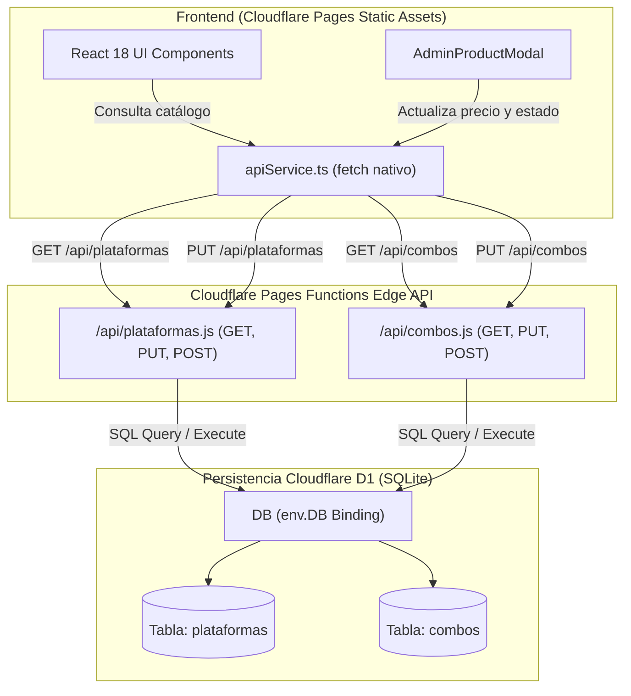
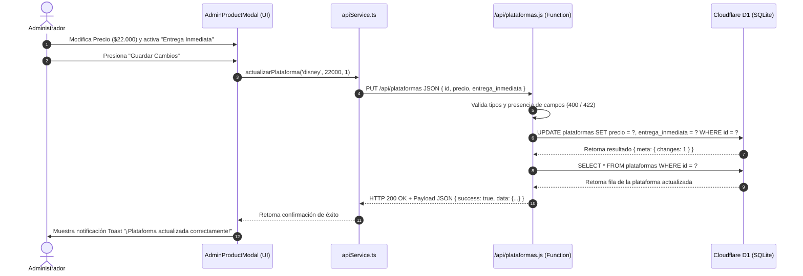

# Documento 1: Arquitectura del Sistema Fullstack (Cloudflare Pages + D1 SQLite)

## Resumen Ejecutivo

Este documento define la arquitectura técnica y los patrones de diseño para la plataforma **Cuentas Stream Multiplataforma** desplegada en **Cloudflare Pages**, respaldada por funciones serverless (**Cloudflare Pages Functions**) y una base de datos SQLite relacional distribuida (**Cloudflare D1**).

El sistema está diseñado bajo los principios de **Clean Architecture**, **Domain-Driven Design (DDD)**, **Vertical Slicing (Feature-Sliced Design)** y persistencia ligera de alto rendimiento.

---

## 1. Mapeo de Capas (Fullstack Serverless Edge)

```
┌─────────────────────────────────────────────────────────────┐
│  CAPA DE PRESENTACIÓN (UI / React 18 + Tailwind CSS)        │
│  - Renderizado adaptativo, Modales de Administración.       │
└─────────────────────────────┬───────────────────────────────┘
                              │ Invocación del servicio API
┌─────────────────────────────▼───────────────────────────────┐
│  CAPA DE SERVICIOS FRONTEND (src/shared/services/apiService)│
│  - Cliente HTTP nativo (fetch), Tipado estricto TypeScript  │
└─────────────────────────────┬───────────────────────────────┘
                              │ Peticiones REST HTTP / JSON
┌─────────────────────────────▼───────────────────────────────┐
│  BACKEND SERVERLESS (Cloudflare Pages Functions /api/*)     │
│  - /api/plataformas.js, /api/combos.js                      │
│  - Validación de esquemas, CORS, Manejo de HTTP Status      │
└─────────────────────────────┬───────────────────────────────┘
                              │ Binding nativo env.DB
┌─────────────────────────────▼───────────────────────────────┐
│  CAPA DE PERSISTENCIA (Cloudflare D1 / SQLite Engine)       │
│  - Tablas: `plataformas`, `combos`                          │
└─────────────────────────────────────────────────────────────┘
```

---

## 2. Diagrama de Componentes del Sistema (Mermaid)



---

## 3. Diagrama de Secuencia de Actualización en Administración (Mermaid)



---

## 4. Registro de Decisiones de Arquitectura (ADR)

### ADR 001: Migración a Cloudflare D1 (SQLite en el Edge)
- **Estatus:** ACEPTADO
- **Contexto:** Se requiere una base de datos relacional ligera, económica y ultra-rápida sin servidores dedicada a una tienda web de cuentas en Colombia.
- **Decisión:** Implementar Cloudflare D1 como motor SQLite nativo vinculado directamente a Cloudflare Pages Functions vía `env.DB`.
- **Consecuencias:** Latencia mínima en lectura (<20ms global), costo cero en capa gratuita y simplicidad de mantenimiento.

### ADR 002: Cero SDKs Comerciales de Terceros
- **Estatus:** ACEPTADO
- **Contexto:** Mantener cero dependencias comerciales pesadas (ej. Supabase SDK, Firebase SDK).
- **Decisión:** Consumir los endpoints de Cloudflare Pages Functions usando el cliente `fetch` nativo de JavaScript/TypeScript (`apiService.ts`).
