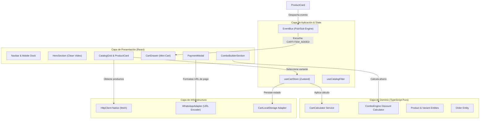
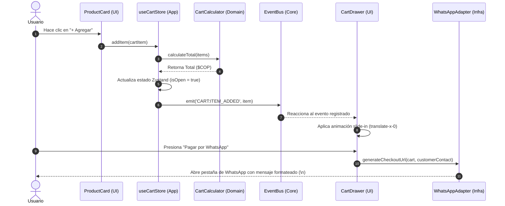

# Documento 1: Arquitectura del Sistema Frontend y Patrones de Diseño

## Resumen Ejecutivo

Este documento define la arquitectura técnica y los patrones de diseño para el frontend de la plataforma de comercio electrónico **Cuentas Stream Multiplataforma**. 

El sistema está diseñado bajo los principios de **Clean Architecture**, **Domain-Driven Design (DDD)**, **Vertical Slicing (Feature-Sliced Design)** y comunicación desacoplada por medio de un **Event Bus (Pub/Sub)** con tipado estricto en TypeScript.

---

## 1. Mapeo de Capas (Clean Architecture + DDD)

El sistema se fragmenta en 4 capas concéntricas con regla de dependencia hacia adentro (el Dominio no conoce nada del exterior):

```
┌─────────────────────────────────────────────────────────────┐
│  CAPA DE PRESENTACIÓN (UI / React Components / Controllers) │
│  - Renderizado de componentes tontos, manipulación de JSX.  │
└─────────────────────────────┬───────────────────────────────┘
                              │ Invocación de hooks / Despacho de eventos
┌─────────────────────────────▼───────────────────────────────┐
│  CAPA DE APLICACIÓN (Casos de Uso / State / Business Svcs)  │
│  - Zustand Store, Event Bus Pub/Sub, Orquestación de flujos │
└─────────────────────────────┬───────────────────────────────┘
                              │ Aplicación de reglas de negocio
┌─────────────────────────────▼───────────────────────────────┐
│  CAPA DE DOMINIO (Entidades, Value Objects, Calculadores)   │
│  - 100% TypeScript Puro (Cero dependencias de React/UI).    │
│  - Reglas de negocio puras, descuentos, cálculo de cart.    │
└─────────────────────────────┬───────────────────────────────┘
                              │ Interfaces / Adaptadores
┌─────────────────────────────▼───────────────────────────────┐
│  CAPA DE INFRAESTRUCTURA (Clientes HTTP, LocalStorage, WA)  │
│  - Cliente HTTP nativo (Cero SDKs comerciales), WA Adapter  │
└─────────────────────────────────────────────────────────────┘
```

---

## 2. Diagrama de Componentes (Mermaid)



---

## 3. Diagrama de Secuencia del Flujo de Compra (Event Bus + Cart Drawer)



---

## 4. Registro de Decisiones de Arquitectura (ADR)

### ADR 001: Adopción de Vertical Slicing + Clean Architecture
- **Estatus:** ACEPTADO
- **Contexto:** Se requiere una arquitectura en React mantenible, desacoplada y escalable.
- **Decisión:** Organizar el código por módulos funcionales (`src/modules/catalog`, `cart`, `combo-builder`, `checkout`) subdivididos internamente en las 4 capas de Clean Architecture.
- **Consecuencia:** Cero acoplamiento entre la lógica de interfaz y las funciones matemáticas de dominio.

### ADR 002: Prohibición de SDKs Comerciales Integrados (Regla 4.2)
- **Estatus:** ACEPTADO
- **Contexto:** Mantener un núcleo liviano sin dependencia de SDKs de terceros para llamadas a pasarelas o persistencia.
- **Decisión:** Implementar un cliente HTTP nativo basado en `fetch` con tipado directo en `src/core/http/httpClient.ts`.
